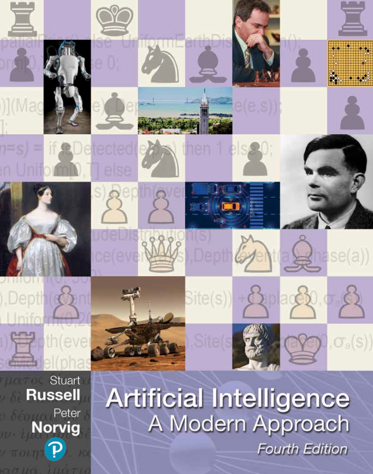

# Artificial-Intelligence-A-modern-Approach
本仓库将按章进行读书笔记

## **人工智能基础：**

定义了人工智能的概念，包括类人行为、类人思考、理性思考和理性行为等方法。

探讨了人工智能的基础学科，如哲学、数学、经济学、神经科学、心理学、计算机工程、控制理论与控制论、语言学等。

## **智能体与环境：**

介绍了智能体的概念，以及智能体与环境之间的交互关系。

阐述了理性智能体的行为准则和性能度量方法。

## **问题求解：**

讲述了通过搜索进行问题求解的方法，包括无信息搜索策略和有信息（启发式）搜索策略。

探讨了复杂环境中的搜索问题，如局部搜索和最优化问题、连续空间中的局部搜索等。

## **对抗搜索和博弈：**

介绍了博弈论在人工智能中的应用，以及博弈中的优化决策方法。

阐述了极小化极大搜索算法、α-β剪枝等博弈搜索算法。

## **约束满足问题：**

讲述了约束满足问题的定义和求解方法，包括约束传播、回溯搜索等。

## **逻辑与推理：**

探讨了逻辑推理在人工智能中的应用，包括命题逻辑、谓词逻辑、一阶逻辑等。

介绍了推理系统、推理方法和推理引擎等概念。

## **概率与不确定性：**

讲述了概率论在人工智能中的应用，包括概率模型、概率推理等。

探讨了处理不确定性的方法，如贝叶斯网络、马尔可夫链等。

## **机器学习：**

介绍了机器学习的基本概念和方法，包括监督学习、无监督学习、强化学习等。

探讨了常用的机器学习算法，如决策树、支持向量机、神经网络等。

## **深度学习：**

讲述了深度学习的基本原理和架构，包括卷积神经网络、循环神经网络等。

探讨了深度学习的训练方法、优化算法和应用场景。

## **自然语言处理：**

介绍了自然语言处理的基本任务和方法，包括文本分类、信息抽取、机器翻译等。

探讨了自然语言处理中的关键技术，如分词、词性标注、句法分析等。

## **计算机视觉：**

讲述了计算机视觉的基本概念和方法，包括图像识别、目标检测、图像分割等。

探讨了计算机视觉中的关键技术，如特征提取、图像匹配、三维重建等。

## **机器人技术：**

介绍了机器人的基本概念和分类，以及机器人在人工智能中的应用。

探讨了机器人的关键技术，如运动规划、路径规划、传感器融合等。

## **自主系统：**

讲述了自主系统的基本概念和原理，包括自主导航、自主决策等。

探讨了自主系统在智能交通、无人机等领域的应用。

## **人工智能伦理与安全：**

介绍了人工智能伦理的基本概念和原则，以及人工智能应用中可能涉及的伦理问题。

探讨了人工智能系统的安全性问题，如数据隐私、网络安全等。

## **人工智能与社会：**

讲述了人工智能对社会的影响，包括就业、教育、医疗等领域。

探讨了人工智能在社会治理、公共服务等方面的应用前景。